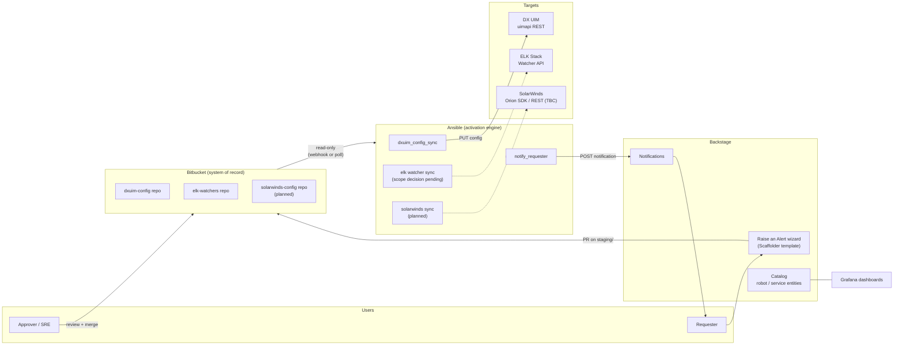
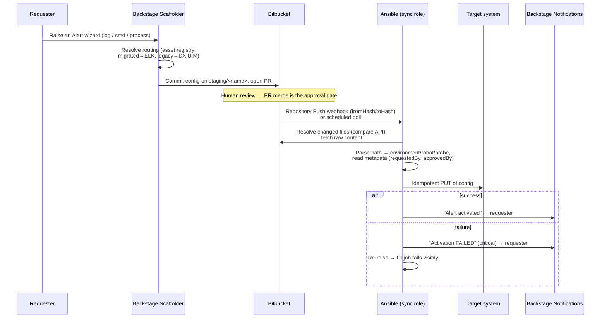

# Alert Automation Platform — Architecture

| | |
|---|---|
| **Status** | Build stage — living document, updated as components land |
| **Author role** | Architect |
| **Last updated** | 2026-07-24 |
| **Stack** | Backstage (developer portal), Bitbucket (Server/DC, system of record), Ansible (activation engine) |
| **Target systems** | DX UIM (Broadcom), ELK Stack (Elasticsearch Watcher), SolarWinds |

This document describes the architecture of the alert-automation platform
that octopod is part of. octopod itself owns only the **DX UIM automation
backend** (see `docs/planning/overview.md` for the scope boundary); this
document deliberately zooms out one level so the per-backend pieces are
understood as instances of one pattern, not three unrelated builds.

---

## 1. Purpose

Teams raise monitoring/alerting requests (log keyword alerts, resource
thresholds, process watchdogs) through a self-service wizard instead of
tickets. Every request becomes a reviewable pull request; every approved
request is activated on the correct monitoring backend automatically;
every requester is told whether activation actually succeeded. Git is the
single source of truth for "what alerting should exist."

## 2. Architecture principles

These are load-bearing decisions, established early and enforced by the
build. Everything else in this document follows from them.

1. **GitOps, one-way.** Ansible only ever *reads* from Bitbucket and
   *writes* to target systems. It never commits, tags, or pushes. All git
   writes happen in Backstage's Scaffolder (request time) or by humans
   (review time). Consequence: the committed document is the *only*
   artifact the activation layer has — anything not captured in it is lost
   (`docs/spec/raise-an-alert-domain-model.md` §2).
2. **PR as the approval gate.** `main` = truth (what should be live),
   `staging/<name>` = one branch per request, PR merge = the approval
   event. There is no separate approval database
   (`docs/design/branching-strategy.html`).
3. **Idempotent activation.** Every config file is a complete,
   current-state description, applied with an idempotent PUT. There is no
   delta/event replay and therefore no commit-tracking state to maintain —
   re-applying is always safe.
4. **One repo / one role per backend.** Each target system gets its own
   config repo and its own Ansible role. octopod is the DX UIM instance
   of this pattern; the ELK watcher-sync role was deliberately removed
   from this repo to enforce the boundary. SolarWinds, when built, gets
   its own as well.
5. **Domain model over wire format.** The committed document should be
   the human-reviewable middle layer — neither raw wizard input nor the
   target system's native payload. Specified in
   `docs/spec/raise-an-alert-domain-model.md` (draft v0.1); *not yet
   implemented* — today's real config files are DX UIM wire format
   (`probeConfigKeys`) passed through almost as-is.
6. **Additive schema evolution.** New fields default to today's implicit
   behavior so pre-existing files keep working; `schemaVersion` exists
   for the day a default has to change.
7. **Notify either way, fail loudly.** A merged PR that fails to activate
   must not fail silently — the repo would disagree with reality. The
   sync notifies the requester on success *and* failure, and still fails
   the CI job on failure so operators see it too.

## 3. System context



Solid lines are built and verified; dashed lines are planned. Note the
one-way flow through Bitbucket: nothing to the right of it ever writes
back to it.

### Roles of each stack component

| Component | Role in the architecture | What it must never do |
|---|---|---|
| **Backstage** | Front door (wizard), inventory (Catalog — the robot/service entities *are* the asset view, there is no separate inventory), and feedback channel (Notifications). | Talk to target systems directly. |
| **Bitbucket** | System of record and approval workflow. One repo per backend; `main` is truth. | Hold anything that isn't reviewable text. |
| **Ansible** | Stateless activation engine: read config from Bitbucket, transform, PUT to target, notify. | Write to git; hold state between runs. |

## 4. Request-to-activation flow



Three sync trigger modes, in priority order (built and verified in
`ansible/roles/dxuim_config_sync/tasks/fetch_from_bitbucket.yml`):

1. **Commit range** (`bitbucket_from_hash`/`to_hash`) — the intended
   production wiring: Bitbucket's push webhook passes its hashes straight
   through; Ansible resolves the changed-file set itself via the compare
   API. Correctly handles multi-commit, multi-robot pushes.
2. **Single file** (`changed_file_path`) — simplest webhook wiring or a
   manual re-run of one file.
3. **Full poll** — no arguments; walks the whole config tree. Safe
   because activation is idempotent; used for drift repair and first runs.

## 5. Repository & data layout

Per-backend config repos share one path convention:

```
{config-root}/{environment}/{asset}/{probe-or-alert}.json
```

DX UIM concretely (`dxuim-config/`, real today):

```
dxuim-config/{environment}/{robot}/{cdm|logmon|processes}.json
dxuim-config/{environment}/{robot}/catalog-info.yaml   ← Backstage registration
```

Key conventions (full detail in `dxuim-config/guide.md`):

- **`metadata` envelope** — `requestedBy` / `approvedBy` entity refs ride
  alongside the payload, are stripped before the PUT, and drive
  notifications. Files predating the convention degrade gracefully
  (sync runs, nobody gets notified).
- **`catalog-info.yaml` per asset folder** — makes the asset visible in
  the Backstage Catalog (owner, lifecycle, Grafana tab). Currently
  hand-authored per commit because Ansible never writes git; the fix is
  a DX UIM Scaffolder template that generates it (backlog,
  `[ELK/backstage]`).
- **Empty file = not configured yet**, not "clear the target." Empty
  configs are skipped, never PUT.

### The domain model layer (specified, not yet implemented)

`docs/spec/raise-an-alert-domain-model.md` defines the target committed
format: a common envelope (`schemaVersion`, `systemType`, `category`,
`routing`, `asset`, `approver`, `metadata` incl. `changeRecordId` and
`sourceTaskId`) plus one category extension (`log` / `cmd` / `process`).
Adopting it means adding a transform step to each sync role — the wire
format moves from "what's committed" to "what Ansible generates at
activation time." This is the single most important pending change to the
data architecture, because it's what makes one committed document shape
serve *all three* target systems.

## 6. Target-system integrations

The pattern per backend is always the same four things: a config repo, a
sync role, a transform (domain model → native payload), and an API
endpoint. The three backends are at very different stages:

### 6.1 DX UIM — built, verified (octopod)

- **Endpoint**: `PUT {dxuim_api_base}/uimapi/probes/{domain}/{hub}/{robot}/{probe}/config`,
  basic auth, body = `probeConfigKeys` array.
- **Hub resolution**: the hub is *not* in the repo path; it's mapped from
  environment via `dxuim_hub_by_environment` in inventory group_vars.
- **Transform**: passthrough today (committed files are already wire
  format). Domain-model transform is specced: Process mapping is real and
  verified against `processes.json`; CDM and Log Monitor key conventions
  are sketched but **unverified** — confirm against Broadcom probe docs
  before implementing (spec §8.1).
- **Resilience**: 3 retries with delay on the PUT, block/rescue wrapping
  so failure notifies the requester *and* fails the job.
- **Verified end-to-end** against `dxuim-stub/` with real Ansible (WSL).
- **Known gaps**: `validate_certs: false` (matches the UAT sample; must
  be revisited before PROD), compare-API pagination logs a warning past
  1000 changes but doesn't page.

### 6.2 ELK Stack — pattern proven, home undecided

- **Mechanism**: Elasticsearch Watcher per log-keyword alert (keyword
  match query against an index pattern, condition on hit count within a
  lookback window, action fires a notification).
- **Status**: the watcher-sync automation exists but was deliberately
  removed from octopod; it currently survives only as a **stale, non-git
  mirror** at `ELK/ansible/` (old repo slug, old branch name, none of the
  M1 hardening). There is a standing decision item: promote it into its
  own repo (the architecture's preferred answer — it matches the
  one-repo-per-backend principle) or explicitly retire it. Leaving it
  rotting is the one wrong option (`docs/planning/backlog.md`).
- **Open design gap**: only `log` has a defined ELK-side shape. `cmd` and
  `process` against an OTel-migrated host have **no designed mechanism at
  all** (Prometheus-style rules over OTel metrics? Grafana-managed
  alerts?). This will be hit the first time someone raises a CMD/Process
  alert on a migrated host (spec §8.2).

### 6.3 SolarWinds — planned, not started

Nothing SolarWinds-specific exists in any repo yet. The architecture for
it is prescribed by the pattern, not invented per-backend:

- **Config repo**: `solarwinds-config/{environment}/{node}/...` with the
  same `metadata` + `catalog-info.yaml` conventions.
- **Sync role**: `solarwinds_config_sync`, structurally cloned from
  `dxuim_config_sync` (same three trigger modes, same block/rescue +
  `notify_requester` reuse — that role was deliberately kept generic for
  exactly this).
- **Transform**: domain model → SolarWinds alert definitions. This is
  the design work: SolarWinds' Orion platform exposes alerting via the
  Orion SDK / SWIS REST API, and its alert model (trigger conditions on
  polled node/interface/application metrics) maps most naturally onto the
  spec's `cmd` and `process` categories rather than `log`.
- **Routing**: `routing.tool` in the domain-model envelope is currently
  `enum: ELK, DX UIM`. Adding SolarWinds means extending this enum and
  the wizard's routing resolution — an additive schema change plus an
  `[ELK/backstage]` wizard change. **Decision needed before build**: what
  determines that an asset routes to SolarWinds (asset registry
  attribute? network-device asset class?).

**Decisions required to start the SolarWinds build** (in order): (1) the
routing rule, (2) which alert categories SolarWinds owns vs. overlaps
with DX UIM, (3) API authentication model and whether SWIS is reachable
from the Ansible execution environment, (4) whether an idempotent
"PUT-equivalent" exists in SWIS — if alert definitions can only be
created/updated by ID, the sync role needs a lookup-then-upsert step,
which is more logic than DX UIM needed but doesn't break principle 3.

## 7. Observability of the platform itself

- **Grafana** (`grafana/`): per-entity and overview dashboards, linked
  from Catalog entities. DX UIM panels are explicit `TODO`s — blocked on
  confirming what actually bridges DX UIM metrics into Grafana (milestone
  item). Sync runs are intended to emit Grafana annotations; the
  annotation key shape is flagged unverified.
- **Backstage Notifications**: the requester-facing feedback channel.
  Request shape built against the 1.20-era API and flagged for
  verification against the installed version.
- **CI job status**: activation failure re-raises after notifying, so
  the pipeline run itself is red — operator-facing signal independent of
  the requester-facing notification.

## 8. Security posture

- **Secrets**: all tokens/passwords in Ansible Vault
  (`vault_bitbucket_token`, `vault_dxuim_password`,
  `vault_backstage_token`); `vault.yml.example` documents the shape.
  `no_log: true` on every task that handles a secret or config payload.
- **Bitbucket access**: bearer token, read-only usage by construction
  (the roles contain no write calls).
- **Browser never talks to Bitbucket**: the planned Catalog
  "Configuration" tab is designed behind a server-side read proxy.
- **Known debt**: `validate_certs: false` on the DX UIM PUT (UAT-only
  assumption); DX UIM uses basic auth per the vendor API.

## 9. Build-stage status matrix

| Capability | Status |
|---|---|
| DX UIM sync (3 trigger modes, retry, notify) | **Built, verified vs stub** |
| Requester notifications (success + failure) | **Built** (API shape unverified vs installed plugin) |
| Branching / PR approval model | **Defined** (`docs/design/branching-strategy.html`) |
| Robot Catalog registration (`catalog-info.yaml`) | **Built, manual** (template to automate is backlog) |
| Domain model schema | **Specified** (draft v0.1) — transform not implemented |
| DX UIM CDM + Log Monitor configs | Placeholders only; key conventions unverified |
| Grafana dashboards | Built; DX UIM panels TODO (no confirmed data source) |
| ELK watcher sync | Exists as stale mirror — repo decision pending |
| ELK cmd/process mechanism | **Not designed** |
| SolarWinds (repo, role, transform, routing) | **Not started** — pattern prescribed in §6.3 |
| DX UIM Scaffolder template | Not built (`[ELK/backstage]`) |
| `changeRecordId` / `sourceTaskId` provenance | Specified, not captured anywhere yet |

## 10. Architectural risks & open questions

1. **Routing staleness** — routing is resolved at request time; a host
   migrating to OTel between commit and activation lands config on the
   old backend. Options (trust-as-committed vs. re-derive at activation
   and fail on disagreement) are documented in the spec §4; undecided.
2. **Branch-name collision** — `staging/<name>` derives from asset
   identity only; two concurrent requests for the same asset collide.
   Fixed by threading `sourceTaskId` into the branch name (also fixes
   notification deep-linking). `[ELK/backstage]`.
3. **Approver identity** — captured as free text in the wizard, not a
   validated entity ref; weakens the audit chain the PR model otherwise
   provides.
4. **Unverified vendor surfaces** — CDM/Log Monitor probe keys, Grafana
   annotation keys, Notifications API shape. All flagged inline where
   assumed; the current milestone's first work item is verifying them.
5. **Three-backend drift** — as ELK and SolarWinds roles come online, the
   pattern (trigger modes, metadata convention, notify contract) must be
   kept identical across roles or the platform decays into three bespoke
   pipelines. Mitigation: `notify_requester` stays shared; consider
   extracting the Bitbucket-fetch tasks into a shared role before the
   second consumer is built, not after the third.

## 11. Related documents

- `docs/planning/overview.md` — scope boundary (octopod vs. wider program)
- `docs/planning/milestones.md` — current milestone: DX UIM base hardening, 30 Sep 2026
- `docs/planning/backlog.md` — itemized gaps referenced throughout
- `docs/spec/raise-an-alert-domain-model.md` — committed document schema (draft)
- `docs/design/branching-strategy.html` — branching/approval model
- `dxuim-config/guide.md` — DX UIM API + metadata/catalog conventions
