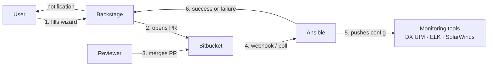
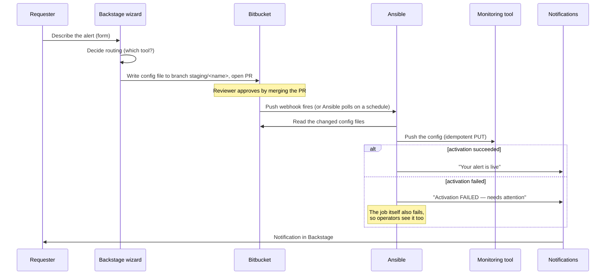

# Alert Automation Platform — Architecture

**Status:** Build stage. This is a living document; the status tables in
section 8 change as components land.

**Stack:** Backstage · Bitbucket · Ansible
**Target systems:** DX UIM · ELK Stack · SolarWinds

---

## 1. What this system does

Today, getting a monitoring alert set up (for example: "page us if this
log shows `OutOfMemoryError`", or "alert if CPU stays above 90% for 5
minutes") means raising a ticket and waiting for someone to configure a
monitoring tool by hand.

This platform replaces that with self-service:

1. A user fills in a **wizard** in Backstage describing the alert they want.
2. The wizard turns that into a **pull request** in Bitbucket. A reviewer
   approves it by merging — the merge *is* the approval.
3. **Ansible** picks up the merged change and pushes the configuration to
   the right monitoring tool (DX UIM, ELK, or in future SolarWinds).
4. The requester gets a **notification** telling them whether the alert
   is now live — or that activation failed and needs attention.

The git repository is the single source of truth for "what alerting
should exist." Nothing gets configured on a monitoring tool that isn't
in git first.

## 2. The big picture



Each of the three stack components has exactly one job:

| Component | Job | Deliberately does NOT |
|---|---|---|
| **Backstage** | The user-facing layer: the request wizard, the catalog of monitored assets, and notifications back to requesters. | Talk to monitoring tools directly. |
| **Bitbucket** | The system of record and the approval workflow. Holds one config repository per monitoring tool. | Hold anything that isn't human-reviewable text. |
| **Ansible** | The activation engine: reads approved config from Bitbucket, pushes it to the monitoring tool, reports the result. | Write to git. Ever. All git writes come from Backstage or humans. |

That last cell is the most important design rule in the platform:
**data flows one way**. Backstage writes to git; Ansible reads from git
and writes to monitoring tools. Because Ansible never writes back,
whatever is committed must contain everything Ansible needs — there is
no side channel.

## 3. Terminology

Terms used throughout this document, for readers who don't work with
these tools daily:

| Term | Meaning |
|---|---|
| **DX UIM** | Broadcom's infrastructure monitoring product (formerly CA UIM). Monitors servers ("Open Systems"). |
| **Robot** | DX UIM's agent installed on a monitored server. One robot = one host. |
| **Probe** | A plugin running on a robot that does one kind of monitoring. The three we use: `processes` (is a process running?), `cdm` (CPU/disk/memory thresholds), `logmon` (log file scanning). |
| **Hub** | A DX UIM server that manages a group of robots. Each environment (UAT, PROD…) has its own hub. |
| **ELK** | Elasticsearch + Logstash + Kibana. Monitors microservice logs; alerts are implemented as **Elasticsearch Watchers** (saved queries that fire on matches). |
| **SolarWinds** | Network/infrastructure monitoring platform. Planned target; not integrated yet. |
| **Scaffolder** | Backstage's template engine. Our "Raise an Alert" wizard is a Scaffolder template: it collects form input and performs git actions. |
| **Catalog** | Backstage's inventory of software and infrastructure. Each monitored server is registered here via a small `catalog-info.yaml` file, which gives it an owner, dashboards, and a page in the portal. |
| **Open System** | A plain server/VM (Linux, Windows, AIX) — as opposed to a microservice running in Kubernetes. |
| **Routing** | The decision of *which* monitoring tool serves a given request. Microservices → ELK. Servers → DX UIM, unless they've been migrated to the new OTel-based stack, in which case → ELK. |

## 4. How a request flows, step by step



Points worth understanding:

- **The PR is the approval gate.** There is no separate approval database
  or workflow tool. `main` always describes what should be live;
  `staging/<name>` branches hold one pending request each.
- **Activation is idempotent.** Config is pushed as a complete "this is
  what should be configured" document, not as a diff. Re-running a sync
  is always safe. This is why Ansible needs no state between runs.
- **Failure is loud, twice.** If activation fails after a PR was merged,
  git and reality now disagree — the worst silent state. So the requester
  is notified with severity *critical*, and the Ansible job still exits
  failed so it shows red in CI.
- **Ansible can be triggered three ways** (all built): by a push webhook
  passing the commit range (the intended production wiring — Ansible
  itself works out which files changed), by naming a single file (manual
  re-runs), or with no arguments at all (full re-sync of everything —
  safe because of idempotency, useful for drift repair).

## 5. What's stored in git

One config repository per monitoring tool, all following the same
folder convention:

```
<config-root>/<environment>/<asset>/<config-file>.json
```

For DX UIM, concretely (this exists today):

```
dxuim-config/
└── UAT/
    └── ulaeiapos0a/            ← one folder per robot (server)
        ├── processes.json      ← process monitoring config
        ├── cdm.json            ← CPU/disk/memory config
        ├── logmon.json         ← log monitoring config
        └── catalog-info.yaml   ← registers the server in Backstage
```

Three conventions apply to every config file:

1. **A `metadata` block rides along** with the config, recording who
   requested and who approved it. Ansible strips it before pushing to
   the monitoring tool and uses it to know who to notify. Old files
   without it still sync — they just can't notify anyone.
2. **An empty file means "not configured yet"**, not "delete what's
   there." Ansible skips empty files and never pushes an empty config.
3. **Every asset folder carries `catalog-info.yaml`** so the asset shows
   up in Backstage. Today this file is written by hand (because Ansible
   never writes git, nothing generates it automatically yet — see
   section 8).

### The planned "domain model" format

Today, the committed files are written in DX UIM's own native format,
which works but has a problem: a PR reviewer sees raw probe
configuration keys, which are hard to review, and the git history is
coupled to one vendor's format.

The fix — specified in `docs/spec/raise-an-alert-domain-model.md`, not
yet implemented — is to commit a **tool-neutral document** instead
("alert on process `*java*`, severity Critical, check every 5 minutes")
and have Ansible translate it into each tool's native format at
activation time. One committed format, three translators. This is the
key pending change, because it's what lets the same request format
serve DX UIM, ELK, *and* SolarWinds.

## 6. The three monitoring tools

Each tool integration is the same four pieces: a config repo, an
Ansible role, a translator (neutral format → tool format), and the
tool's API. The three tools are at very different stages.

### 6.1 DX UIM — ✅ built and verified

This is what the octopod repository contains.

- Ansible reads config from Bitbucket and pushes it with a single API
  call per probe:
  `PUT /uimapi/probes/{domain}/{hub}/{robot}/{probe}/config`.
- The hub isn't stored in the repo path — Ansible looks it up from a
  per-environment mapping in its inventory.
- Failed pushes retry 3 times, then notify the requester and fail the job.
- The whole path has been tested end-to-end against a local stub of the
  DX UIM API (`dxuim-stub/`) using real Ansible.

Known limitations, tracked in the backlog: TLS verification is switched
off (acceptable for UAT, must change before PROD), and very large pushes
(over 1,000 changed files) would only be partially detected — a warning
is logged, but paging isn't implemented.

### 6.2 ELK — ⚠️ working pattern, but currently homeless

Log alerts on ELK are implemented as Elasticsearch Watchers, and
automation for syncing them exists — but it was deliberately moved *out*
of this repository (one repo per tool), and its new home was never
created. It currently sits as an out-of-date copy in a OneDrive folder,
which is the worst of both worlds. **A decision is pending**: give it
its own git repository (recommended — it matches the one-repo-per-tool
rule) or formally retire it.

Separately, only *log* alerts have a designed ELK implementation.
CPU/memory/process alerts for servers that have migrated to the new
stack have **no designed mechanism yet** — this gap will be hit the
first time someone requests one.

### 6.3 SolarWinds — ⭕ planned, not started

Nothing SolarWinds-related exists in any repository yet. When built, it
follows the established pattern rather than inventing a new one:

- Its own config repo (`solarwinds-config/`) with the same folder and
  metadata conventions.
- Its own Ansible role, structurally copied from the DX UIM one — the
  notification role was deliberately built to be shared, so it plugs in
  as-is.
- A translator from the neutral format to SolarWinds alert definitions,
  talking to the SolarWinds Orion API.

Four decisions are needed before build starts:

1. **Routing rule** — what property of an asset says "this one is
   monitored by SolarWinds"? (Today routing only knows ELK and DX UIM.)
2. **Category ownership** — which alert types does SolarWinds handle,
   and where does it overlap with DX UIM?
3. **Access** — API credentials, and whether the SolarWinds API is
   reachable from where Ansible runs.
4. **Idempotency check** — confirm SolarWinds' API supports a safe
   "set it to exactly this" update. If it only supports create/update by
   ID, the role needs a lookup step first (more logic, but the one-way,
   stateless design still holds).

## 7. Security, in brief

- All credentials (Bitbucket token, DX UIM password, Backstage token)
  live in Ansible Vault; every task handling secrets or payloads has
  logging suppressed.
- Ansible's Bitbucket access is read-only by construction — the roles
  contain no write calls.
- Browsers never talk to Bitbucket directly; any future UI that shows
  config from git goes through a server-side proxy.
- Known debt: TLS verification is disabled on the DX UIM call (UAT
  assumption — fix before PROD).

## 8. What's built vs. what isn't

| Piece | Status |
|---|---|
| DX UIM sync — webhook/single-file/full-sync triggers, retries, notifications | ✅ Built, tested against stub |
| Requester notifications (success and failure) | ✅ Built (request format still to be verified against the installed Backstage version) |
| Branching / PR-approval model | ✅ Defined and in use |
| Server registration in Backstage Catalog | ✅ Works, but manual — automation depends on a wizard change (owned by the Backstage repo, not octopod) |
| Tool-neutral config format (domain model) | 📄 Specified, translator not implemented |
| Real CPU/memory and log configs for the first server | ⭕ Placeholder files only |
| Grafana dashboards | ⚠️ Built, but DX UIM panels are TODO — no confirmed data source yet |
| ELK watcher sync | ⚠️ Exists as a stale copy — needs a home (decision pending) |
| ELK CPU/memory/process alerting | ⭕ Not designed |
| SolarWinds (everything) | ⭕ Not started — see section 6.3 |
| Audit trail (change record ID, request task ID in committed files) | 📄 Specified, not captured yet |

Current milestone: **DX UIM base hardening, due 30 September 2026** —
verify the unverified assumptions above, fill in the placeholder
configs, and resolve the ELK-home decision. Details in
`docs/planning/milestones.md`.

## 9. Open risks and decisions

1. **Stale routing.** The "which tool?" decision is made when the
   request is raised, not when it's activated. If a server migrates
   between request and activation, config lands on the old tool.
   Documented options exist (spec §4); no decision yet.
2. **Branch-name collisions.** Two simultaneous requests for the same
   server would generate the same `staging/<name>` branch name. Fix is
   specified (include the request's task ID in the name) but belongs to
   the wizard, which lives in the Backstage repo.
3. **Approver is free text.** The wizard captures the approver's name as
   typed, not as a validated identity — weakening an otherwise strong
   audit chain.
4. **Unverified vendor assumptions.** Several integration details
   (DX UIM's cdm/logmon key format, the Backstage notifications request
   shape, Grafana annotation keys) were built from documentation, not
   verified against the installed systems. Verifying them is the current
   milestone's first work item; each is flagged inline in the code.
5. **Three-tool drift.** With three parallel tool integrations, the
   shared conventions (trigger modes, metadata block, notification
   contract) must stay identical or the platform decays into three
   bespoke pipelines. The notification role is already shared; the
   Bitbucket-reading logic should be extracted into a shared role when
   the second consumer is built — not after the third.

## 10. Where to read more

| Document | What it covers |
|---|---|
| `docs/planning/overview.md` | Scope boundary: what octopod owns vs. the wider program |
| `docs/planning/milestones.md` | Current milestone and its contents |
| `docs/planning/backlog.md` | Every known gap, itemized and tagged by owning repo |
| `docs/spec/raise-an-alert-domain-model.md` | The tool-neutral config format (draft) |
| `docs/ui-ux-design/branching-strategy.md` | The branching/approval model, illustrated |
| `dxuim-config/guide.md` | DX UIM API usage and file conventions |
