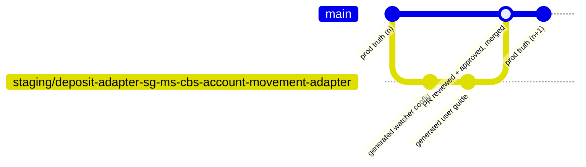
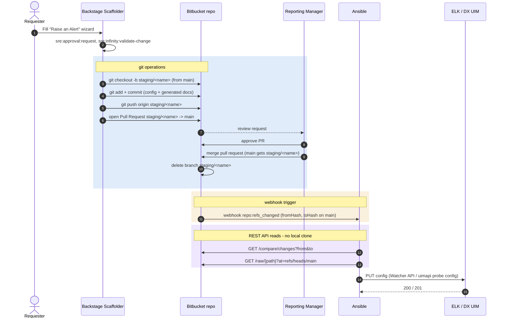

# Branching strategy & the git operations behind a config change

Applies to the config repos (`elk-watchers` / `dxuim-configs`).

Every "Raise an Alert" request lands on its own short-lived branch,
gets reviewed as a Pull Request, and only becomes real once merged.
Ansible never clones anything — it reads the result over Bitbucket's
REST API.

## The three rules

- **`main` = production truth**, watched by Ansible.
- **`staging/<name>` = one branch per request**, deleted after merge.
- **PR into `main` = the approval gate.**

## Branch topology

One request (a keyword alert for `ms-cbs-account-movement-adapter`)
shown end-to-end. The same shape applies to `dxuim-configs` — just
`staging/<environment>-<robot>` instead.

## Full sequence — every git operation and API call, in order

The **git operations** block is the only place actual git plumbing
happens — all done by Backstage's `publish:bitbucketServer` action and
the human approver. The **REST API reads** block is Ansible's entire
involvement with the repo — there is no `git clone` anywhere on that
side.

## Legend

- **Git operations** (blue block) — branch, commit, push, PR, merge,
  delete. All performed by Backstage's publish action and the human
  approver; this is the only place actual git plumbing happens.
- **Webhook trigger** (amber block) — Bitbucket's `repo:refs_changed`
  event, fired once the merge lands on `main`. This is the one step
  that bridges the git-operations phase and the REST-read phase;
  everything Ansible does afterward is driven by the
  `fromHash`/`toHash` it carries.
- **REST API reads** (violet block) — `compare/changes` and `raw`
  against Bitbucket's HTTP API. Ansible has no working copy, no `.git`
  directory, nothing to keep in sync — it just asks Bitbucket for a
  diff and file contents on demand.
